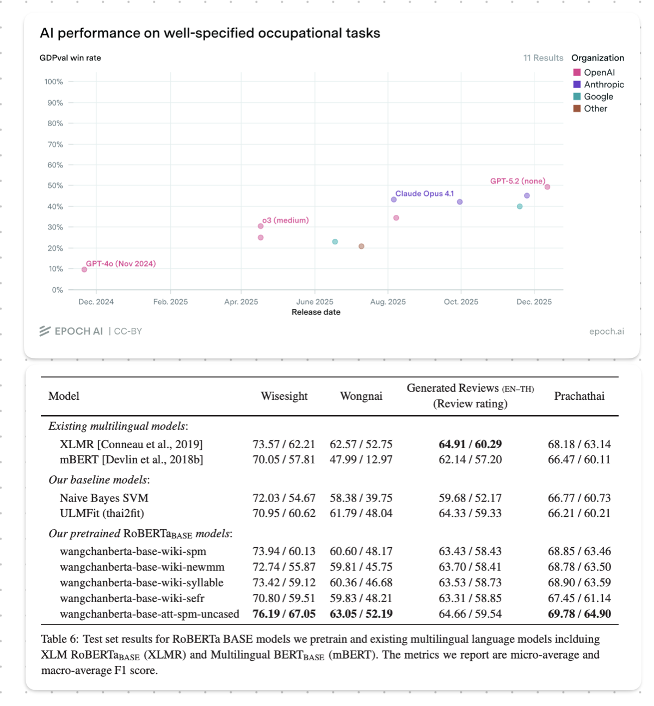

> This series document statistical tomfooleries in AI evaluation that I may or may not have witnessed from "academic researches" and "technical works" in the wild. For educational purposes only. All characters appearing in this work are fictions. Any resemblance to real persons, living or dead, is purely coincidental. Do not try this at home.

## Background on Benchmaxxing in the Finetuning Game

Statistical robustness has taken somewhat of a back seat in modern LLM evaluation, and perhaps reasonably so. Frontier benchmarks such as [SWE-Bench](https://www.swebench.com/original.html#:~:text=SWE%2Dbench%20was%20released%20in,12.47%25%20on%20SWE%2Dbench.) and [GDPEval](https://epoch.ai/benchmarks/gdpval?view=graph&tab=release-date&metric=win_rate) often start near 0% then subsequently jump with new model iterations; for example, 9.9%→30.8% from GPT-4o to o3 medium on GDPEval. We do not need a hypothesis test to tell us that these uplifts are statistically significant at `p-value = 0.0000...`. Nonetheless, in the shadow of corporate juggernauts vying for foundational model supremacy, the 2nd/3rd-tier players are engaged in more incremental improvements (0.5-1%), one of which is **localizing frontier models**. 

::: {.column-screen}

:::

The playbook usually goes like this: 

1. Take an open-source, frontier model from a Chinese lab of your choice (Qwen, Deepseek, Kimi, GLM, MiniMax, etc.).

2. Finetune it on your language and/or domain.

3. Test on a self-made/curated local benchmark to show 0.5-1% improvement on the base model.

4. Profit💲💲; literally, as most of these 2nd/3rd-tier players either live off of government funding under the guise of "protecting AI sovereignty"^2^ or are trying to convince stakeholders in their domains (usually finance and medical) that their finetuning activities have some value-added, however marginally.

I am all good about people trying to make a living, but this playbook has spawned some undesirable behaviors in AI system evaluation. By nature of these localization projects, the benchmarks are limited in quantity (the most sloppy one I have seen has as few as 100 test examples per task), quality (most benchmarks are curated by the same teams finetuning the models without any rigorous independent oversight, maybe even using a subset of the finetuning set!), and most importantly **the ability to distinguish between a successful finetuning and statistical noise**. Unlike in the case of frontier models where the leap of progress is enormous, claiming success on 0.5-1% difference in point estimates is at best naive and at most unscrupulous. This is especially relevant since these claims could lead to approval of multi-million-USD funding in taxpayer's money.

## The Synthetic Setup

Comparing point estimates might warrant the benefit of the doubt, but artificially narrowing down the confidence intervals by abusing bootstrapping, both conceptually AND mathematically, certainly does not. 

Let us see this in action using a synthetic example of a classification-style benchmark^3^ with 4,000 questions. We compare a base model A, a finetuned model that failed B (0pp true uplift in performance), and one that succeeded C (+1pp true uplift in performance). Each model predicts a binary or multiple-choice answer to each question and is scored on accuracy. First, we need a generative process that mirrors what LLM evaluations actually look like. A few empirical anchors shape the setup:

1. **Overall accuracy lands around 57%** across the 4,000 questions for model A. This is roughly where mid-sized models score on a reasonably difficult multi-language benchmark.

2. **Answer consistency across runs is high.** [Cavalin et al. (2025)](https://arxiv.org/abs/2509.09705) report that medium-sized models like Llama-3.3-70B give the same answer to the same question in 96–98% of repetitions on MMLU at low temperature, with per-run accuracy standard deviations as low as 0.1pp. A ~32B model at low temperature should live in a similar regime on pure MMLU-style tasks, but aggregated multi-task benchmarks typically mix in higher-variance metrics such as ROUGE and win-rate, which pull effective consistency down. We target ~87% pairwise answer consistency so that methods below match reported "confidence intervals" in the wild.

To simulate decoding stochasticity between runs, we draw each question's latent probability of being answered correctly, $p_q$, from a three-component mixture: a fraction of "easy" questions the model always gets right ($p_q = 1$), a fraction of "hard" questions it always gets wrong ($p_q = 0$), and a "middle" fraction where $p_q \sim \text{Uniform}(0.2, 0.8)$. 

Each indepedent run for each question is then an independent draw from $\text{Bernoulli}(p_q)$. Crucially, B and C inherit A's latent per-question difficulty where B is a clone of A (identical true accuracy, same difficulty profile), and C promotes 1% of A's "hard" questions into "easy" ones for a clean +1pp uplift. This mirrors how a finetune of a base model typically shares most of its correct/incorrect behavior with the base and differs on only a small fraction of questions.

Below are mean observed accuracies, per-run standard deviations and pairwise consistency (how many percentage of 4,000 answers are the same on average) across 8 simulated runs.

```{python}
#| code-fold: true
#| echo: true
#| output: true

import numpy as np
import pandas as pd
from scipy import stats
from plotnine import (
    ggplot, aes, geom_point, geom_errorbarh,
    facet_wrap, labs, theme_bw, theme, element_text,
    scale_color_brewer,
)

SEED = 20260504
N_QUESTIONS = 4000
N_RUNS = 8
Z = 1.96

A_EASY, A_HARD = 0.420, 0.280
UPLIFT = 0.01                         # +1pp true uplift for model C


def sample_p_q(n: int, pi_easy: float, pi_hard: float, rng: np.random.Generator) -> np.ndarray:
    """Draw per-question true success probabilities from the 3-mixture."""
    u = rng.random(n)
    return np.where(
        u < pi_easy, 1.0,
        np.where(u < pi_easy + pi_hard, 0.0, rng.uniform(0.2, 0.8, size=n)),
    )

def derive_finetune(p_base: np.ndarray, uplift: float, rng: np.random.Generator) -> np.ndarray:
    """Promote a random `uplift` fraction of base's hard questions (p=0) to easy (p=1).
    Every other question is unchanged, so the finetune shares latent difficulty with
    the base on (1 - uplift) of the benchmark — the realistic regime for a finetune."""
    p = p_base.copy()
    hard_idx = np.where(p_base == 0.0)[0]
    n_promote = int(round(uplift * len(p_base)))
    p[rng.choice(hard_idx, size=n_promote, replace=False)] = 1.0
    return p


def simulate_runs(p_q: np.ndarray, n_runs: int, rng: np.random.Generator) -> np.ndarray:
    """Draw n_runs x n_q independent Bernoulli(p_q) scores."""
    return (rng.random((n_runs, len(p_q))) < p_q).astype(int)


def pairwise_consistency(s: np.ndarray) -> float:
    """Fraction of (run_i, run_j) pairs per question that agree, averaged over questions."""
    n_runs, n_q = s.shape
    agree = total = 0
    for i in range(n_runs):
        for j in range(i + 1, n_runs):
            agree += (s[i] == s[j]).sum()
            total += n_q
    return agree / total


rng = np.random.default_rng(SEED)
p_A = sample_p_q(N_QUESTIONS, A_EASY, A_HARD, rng)
p_B = p_A.copy()                              # failed finetune: identical to A
p_C = derive_finetune(p_A, UPLIFT, rng)       # successful finetune: +1pp true uplift
p_truth = {"A": p_A, "B": p_B, "C": p_C}
scores = {name: simulate_runs(p, N_RUNS, rng) for name, p in p_truth.items()}

for name, s in scores.items():
    acc_per_run = s.mean(axis=1)
    print(
        f"Model {name}: true acc {p_truth[name].mean()*100:.2f}%, "
        f"obs acc {acc_per_run.mean()*100:.2f}%, "
        f"per-run stdev {acc_per_run.std(ddof=1)*100:.3f}pp, "
        f"pairwise consistency {pairwise_consistency(s)*100:.1f}%"
    )
```

## The Honest Way: McNemar's Test on One Run

Before reaching for any bootstrap machinery, let us ask the simpler question: if we ran each model *once* on the same 4,000 questions and applied a proper test, could we detect a 1pp uplift?

The test for binary-scored paired data is [McNemar's test](https://en.wikipedia.org/wiki/McNemar%27s_test)^4^. It looks at the questions where the two models disagreed, called discordant pairs, and asks whether the disagreements lean systematically one way. Questions where both models got the same answer cancel out of the difference, so they contribute nothing to the test statistic, which is exactly why pairing gives tighter confidence intervals than treating the two runs as independent samples. For the single-run case with $n_{01}$ questions where B beat A and $n_{10}$ questions where A beat B, the observed difference in accuracies is $\hat{\delta} = (n_{01} - n_{10})/n$ with standard error $\text{SE}(\hat{\delta}) = \sqrt{(n_{01} + n_{10})/n^2}$.

```{python}
#| code-fold: true
#| echo: true
#| output: true

def mcnemar_test(x: np.ndarray, y: np.ndarray) -> dict:
    """Paired test on single-run binary scores; returns diff, SE, 95% CI, z, p.

    Implementation note. The textbook McNemar's statistic is chi-squared:
        chi2 = (n01 - n10)**2 / (n01 + n10),  df=1
    We use the algebraically equivalent z-form z = (n01 - n10) / sqrt(n01 + n10),
    which satisfies z**2 = chi2 and produces identical two-sided p-values under
    the normal approximation (sanity-checked against statsmodels in the appendix).
    The z-form is preferred here because we also need a directional SE on the
    accuracy difference in order to build the CI used in the plots.
    """
    n10 = int(((x == 1) & (y == 0)).sum())   # x right, y wrong
    n01 = int(((x == 0) & (y == 1)).sum())   # x wrong, y right
    n = len(x)
    diff = (y.mean() - x.mean()) * 100
    se = np.sqrt(n10 + n01) / n * 100
    z = diff / se if se > 0 else 0.0
    p = 2 * (1 - stats.norm.cdf(abs(z)))
    return {"diff": diff, "se": se, "ci95": Z * se, "z": z, "p": p, "n10": n10, "n01": n01}


# One run per model: the honest cheap comparison.
a0, b0, c0 = scores["A"][0], scores["B"][0], scores["C"][0]
rows = []
for label, x, y in [("A vs B (true diff = 0)", a0, b0), ("A vs C (true diff = +1pp)", a0, c0)]:
    r = mcnemar_test(x, y)
    rows.append({
        "comparison": label,
        "obs diff": f"{r['diff']:+.2f}pp",
        "95% CI on diff": f"±{r['ci95']:.2f}pp",
        "z": f"{r['z']:.2f}",
        "p-value": f"{r['p']:.3f}",
    })
pd.DataFrame(rows)
```

In this particular simulation the 1pp uplift (A-vs-C) lands at z = 3.47 with p = 0.001, which looks convincing. But that is a single draw of the benchmark. With a different seed, the observed gap will land somewhere else, and that somewhere-else determines whether the test rejects the null or not. To build intuition, let us repeat the single-run comparison five times with different seeds and see what happens.

```{python}
#| code-fold: true
#| echo: true
#| output: true
trial_rows = []
for trial in range(5):
    trial_rng = np.random.default_rng(SEED + trial * 997)
    p_A_t = sample_p_q(N_QUESTIONS, A_EASY, A_HARD, trial_rng)
    p_B_t = p_A_t.copy()
    p_C_t = derive_finetune(p_A_t, UPLIFT, trial_rng)
    a1 = (trial_rng.random((1, N_QUESTIONS)) < p_A_t).astype(int)[0]
    b1 = (trial_rng.random((1, N_QUESTIONS)) < p_B_t).astype(int)[0]
    c1 = (trial_rng.random((1, N_QUESTIONS)) < p_C_t).astype(int)[0]

    r_AB = mcnemar_test(a1, b1)
    r_AC = mcnemar_test(a1, c1)
    trial_rows.append({
        "trial": trial + 1,
        "A vs B obs diff": f"{r_AB['diff']:+.2f}pp",
        "A vs B p-value": f"{r_AB['p']:.3f}",
        "A vs B verdict": "false positive" if r_AB["p"] < 0.05 else "correctly ns",
        "A vs C obs diff": f"{r_AC['diff']:+.2f}pp",
        "A vs C p-value": f"{r_AC['p']:.3f}",
        "A vs C verdict": "detected" if r_AC["p"] < 0.05 else "missed",
    })
pd.DataFrame(trial_rows)
```

Look at what happened. On the A-vs-B comparison (the two models are identical, true difference = 0), all five trials gave non-significant p-values; no false positives, which is what a calibrated 5% test should deliver most of the time. The observed differences bounced around ±0.3pp from pure decoding noise, but they stayed within the ±1.1pp McNemar's band so nothing looked like a win.

The A-vs-C comparison is more interesting. Only 2 of the 5 trials rejected the null at p < 0.05. Trials 1 and 2 happened to catch the +1pp effect, but they overshot; the observed differences were +2.08pp and +1.95pp, roughly twice the true effect, inflated by favorable decoding noise. Trial 3 undershot to +0.48pp and missed entirely (p = 0.43). Trials 4 and 5 landed close to the true +1pp effect but just short of the p<0.05 threshold.

This is how statistical power works in practice. In this particular case, the signal you are trying to detect is buried in enough noise that you see it clearly only about 40% of the time, even with the correct test. This is not a failing of the McNemar's test; 4,000 questions is simply too few detect 1pp uplift reliably. No amount of statistical cleverness will change that fundamental limit. This is the uncomfortable truth that drives people toward bootstrap shenanigans.

```{python}
#| code-fold: true
#| echo: true
#| output: true

E_u_1_minus_u = 0.5 - 0.28                         # E[U(1-U)] for U ~ Uniform(0.2, 0.8)
p_middle = 1 - A_EASY - A_HARD                     # middle-bucket share
p_noise_discord = p_middle * E_u_1_minus_u         # per-q one-direction discord from decoding noise

# Promotion moves questions from hard (p=0) to easy (p=1), so middle contributes to
# decoding-noise discord on ALL questions (not just (1 - UPLIFT) of them). Promoted
# questions add a deterministic contribution of UPLIFT to p_01.
p_01 = p_noise_discord + UPLIFT * 1.0
p_10 = p_noise_discord + UPLIFT * 0.0
pi_D = p_01 + p_10                                 # expected total discordance rate
delta = p_01 - p_10                                # expected signed difference per question

# Under the alternative, z ≈ δ·sqrt(n / π_D); power follows from the normal approximation.
z_H1 = delta * np.sqrt(N_QUESTIONS / pi_D)
mcnemar_power = stats.norm.cdf(z_H1 - Z) + stats.norm.cdf(-z_H1 - Z)

print(f"Expected discordance rate π_D: {pi_D*100:.1f}%  (of 4,000 questions)")
print(f"Expected signed difference δ: {delta*100:+.2f}pp")
print(f"Expected z under H1: {z_H1:.2f}")
print(f"Analytical power of McNemar's test to detect +1pp uplift: {mcnemar_power*100:.1f}%")

# Empirical power: simulate many single-run A-vs-C comparisons and count rejections.
N_POWER_SIMS = 2000
rejections = 0
power_rng = np.random.default_rng(SEED + 42)
for _ in range(N_POWER_SIMS):
    p_A_sim = sample_p_q(N_QUESTIONS, A_EASY, A_HARD, power_rng)
    p_C_sim = derive_finetune(p_A_sim, UPLIFT, power_rng)
    a_sim = (power_rng.random(N_QUESTIONS) < p_A_sim).astype(int)
    c_sim = (power_rng.random(N_QUESTIONS) < p_C_sim).astype(int)
    if mcnemar_test(a_sim, c_sim)["p"] < 0.05:
        rejections += 1
print(f"Empirical power over {N_POWER_SIMS} simulated benchmarks: {rejections / N_POWER_SIMS * 100:.1f}%")
```

## Bootstrapping-for-Narrower-Confidence-Intervals no Jutsu

With a 1pp effect sitting at ~40% single-run detection power, the temptation is obvious: pad the story with more statistical smoke and mirrors until the CI looks small. This is where bootstrap procedures start creeping into localization papers. Instead of running a McNemar's test once and gambling your multi-million government contract with worse odds than a coin flip, why not run it 8 times (just small enough to cherry-pick) and bootstrap (sample with replacement) each question's answer for 30 hypothetical runs? If you have any exposure to *Introduction to Statistics*ーor I do not know, common senseーyou would intuitively question how one can infer variations from just 8 independent runs, no matter how many times they re-sample with replacement.

We walk through three, increasingly more degenerate bootstrap flavors below, each introducing one more shortcut that shrinks the CI without actually adding information. To make the visual differences obvious, we pick a seed^5^ where the narrowest method happens to land in its failure mode, one of the parallel-universe benchmarks where it flags the failed finetune model B as significantly different from A even though the two models are structurally identical. This is not to cherry-pick to be unfair; the 500-simulation calibration in the later section confirms that ~40% is the method's typical false-positive rate (poetically trading off 40% power for 40% false positive rate), not an edge case.

```{python}
#| code-fold: true
#| echo: true
#| output: true

DISPLAY_SEED = 20260508
display_rng = np.random.default_rng(DISPLAY_SEED)
p_A_d = sample_p_q(N_QUESTIONS, A_EASY, A_HARD, display_rng)
p_B_d = p_A_d.copy()
p_C_d = derive_finetune(p_A_d, UPLIFT, display_rng)
p_truth_d = {"B": p_B_d, "A": p_A_d, "C": p_C_d}
scores_d = {name: simulate_runs(p, N_RUNS, display_rng) for name, p in p_truth_d.items()}

for name in ["A", "B", "C"]:
    s = scores_d[name]
    acc = s.mean(axis=1)
    print(f"Display seed model {name}: true {p_truth_d[name].mean()*100:.2f}%, "
          f"obs {acc.mean()*100:.2f}%, per-run stdev {acc.std(ddof=1)*100:.3f}pp")
```

```{python}
#| code-fold: true
#| echo: true
N_BOOTSTRAPS = 30            # same B across all bootstrap flavors below


def ci_question_bootstrap(s: np.ndarray, rng: np.random.Generator) -> tuple[float, float, float]:
    """(1) Question-bootstrap: resample questions with replacement; per-question score = mean of 8 runs.
    The widest of the three and the only one that captures question-sampling variability."""
    per_q_score = s.mean(axis=0)
    n_q = len(per_q_score)
    idx = rng.integers(0, n_q, size=(N_BOOTSTRAPS, n_q))
    replicate_acc = per_q_score[idx].mean(axis=1)
    mean = per_q_score.mean()
    se = replicate_acc.std(ddof=1)
    return mean, mean - Z * se, mean + Z * se


def ci_run_bootstrap_fixed(s: np.ndarray, rng: np.random.Generator) -> tuple[float, float, float]:
    """(2) Run-bootstrap with honest SE = stdev(replicates). Resamples runs instead of questions,
    so it measures only decoding noise, not question-sampling variability."""
    n_runs, n_q = s.shape
    idx = rng.integers(0, n_runs, size=(N_BOOTSTRAPS, n_q))
    replicate_acc = s[idx, np.arange(n_q)].mean(axis=1)
    mean = replicate_acc.mean()
    se = replicate_acc.std(ddof=1)
    return mean, mean - Z * se, mean + Z * se


def ci_run_bootstrap_sqrt_b(s: np.ndarray, rng: np.random.Generator) -> tuple[float, float, float]:
    """(3) Run-bootstrap with SE = stdev(replicates) / sqrt(B). The method in the wild.
    Numerator is an 8-run average; denominator pretends to be the SE of a 30-run average."""
    n_runs, n_q = s.shape
    idx = rng.integers(0, n_runs, size=(N_BOOTSTRAPS, n_q))
    replicate_acc = s[idx, np.arange(n_q)].mean(axis=1)
    mean = replicate_acc.mean()
    se = replicate_acc.std(ddof=1) / np.sqrt(N_BOOTSTRAPS)
    return mean, mean - Z * se, mean + Z * se


rows = []
method_order = [
    "(1) Question-bootstrap",
    "(2) Run-bootstrap, SE honest",
    "(3) Run-bootstrap, SE / sqrt(B)",
]
method_fns = {
    method_order[0]: ci_question_bootstrap,
    method_order[1]: ci_run_bootstrap_fixed,
    method_order[2]: ci_run_bootstrap_sqrt_b,
}
for m_idx, name in enumerate(["A", "B", "C"]):
    s = scores_d[name]
    for k_idx, method in enumerate(method_order):
        # Deterministic per-(model, method) seed so the plot is stable across runs.
        rng_m = np.random.default_rng(DISPLAY_SEED + 1000 * m_idx + k_idx)
        m, lo, hi = method_fns[method](s, rng_m)
        rows.append({
            "model": name,
            "method": method,
            "mean": m * 100,
            "lo": lo * 100,
            "hi": hi * 100,
            "half_width": (hi - m) * 100,
        })

ci_df = pd.DataFrame(rows)
ci_df["± (95% CI)"] = ci_df["half_width"].map(lambda x: f"±{x:.2f}")
ci_df["accuracy"] = ci_df["mean"].map(lambda x: f"{x:.2f}%")
display_df = ci_df.pivot(index="method", columns="model", values=["accuracy", "± (95% CI)"])
display_df = display_df.reindex(method_order)
display_df
```

```{python}
#| code-fold: true
#| echo: true
#| fig-width: 9
#| fig-height: 5

ci_df["method"] = pd.Categorical(ci_df["method"], categories=method_order, ordered=True)
ci_df["model"] = pd.Categorical(ci_df["model"], categories=["C", "B", "A"], ordered=True)

plot = (
    ggplot(ci_df, aes(x="mean", y="model", color="model"))
    + geom_errorbarh(aes(xmin="lo", xmax="hi"), height=0.25, size=0.8)
    + geom_point(size=2.5)
    + facet_wrap("~method", ncol=1, scales="free_x")
    + scale_color_brewer(type="qual", palette="Set1", guide=None)
    + labs(
        x="Benchmark accuracy (%)",
        y="Model",
        title="Same data, four confidence intervals",
    )
    + theme_bw()
    + theme(
        strip_text=element_text(size=10),
        axis_title=element_text(size=10),
        plot_title=element_text(size=12, weight="bold"),
    )
)
plot
```

**Method (1): question-bootstrap.** We resample questions with replacement, using the mean of 30 runs as each question's score. The resampling directly simulates drawing a different 4,000-question benchmark from the same distribution, which is exactly the uncertainty we care about when we claim "the finetune is better on XX language/domain". The CI lands around ±1pp on single-model accuracy. A, B, and C overlap heavily, which correctly reflects that on a 4,000-question benchmark with 87% consistency, resolving a 1pp difference is nearly impossible.

**Method (2): run-bootstrap with honest SE.** Instead of resampling questions, we resample the 8 runs *per question*: for every bootstrap replicate, each question independently picks one of its 8 observed answers, and the replicate's accuracy is the mean of those 4,000 picks. This produces a distribution of **"what accuracy would we have gotten on these same 4,000 questions if we had drawn a different decoding seed?"** Note the weirdness baked into the procedure alreadyーFrankenstein run whose question 17 comes from seed 3 and question 42 comes from seed 7ーbut this is exactly the recipe that shows up in the wild, so we faithfully reproduce it.

> Now, I would like readers to pause here for a second and think about if we really care about decoding noise so much we would need to engage in this statistical wizardry; the answer is most likely no. But people who are trying to advertise this as a legitimate method either wants you to think so or hopes you would confuse this with what method (1) is trying to do.

Because 87%-consistent models give near-identical answers across runs, the decoding-only CI narrows significantly compared to method (1). A and B still overlap here (correctly), but C at least should outperform A in a statistically significant manner more often. The method has not cheated mathematically, BUT it is misrepresenting decoding noise as variation in the models' ability to answer questions in the language/domain.

**Method (3): run-bootstrap with SE / √B.** Now what do you do if you want to be EXTRA sure your failed finetuning would still look decent? Same resampling as method (2), but instead of calculating the bootstrapped standard error as standard deviation of the 30 observed accuracies, we further divide it by √B (B=30), as though the 30 bootstrap replicates were 30 independent runs, inflating the test statistics by $\sqrt{30}$. The CI drops to ±0.10-0.13pp, about 10x tighter than method (1). The procedure declares the failed finetuned model B significantly better than A. If you glance at it, you may conclude the method can resolve differences at a fraction-of-a-percentage-point scale, but the apparent precision is a product of a fabrication, not of the data.

## The Honest Fix: More Independent Runs or Paired t-Test

The three bootstrap methods above span the range from "honest but blunt" (question-bootstrap, wide CI) to "badly miscalibrated" (run-bootstrap /√B, fake precision). None of them delivers a sharp, well-calibrated answer to the question anyone cares about. Two honest alternatives do.

**More Independent Runs.** The most obvious fix is the one the run-bootstrap-with-/√B is dishonestly pretending to simulate: just run the evaluation more times. With 30 real decoding seeds per model on the same 4,000 questions, the SE-of-the-mean across runs gives a properly calibrated CI. Ironically, this is the same CI as the miscalibrated method (3) in the bootstrap section, but now the 30 replicates are actually independent rather than synthesized from 8. Therefore, if your finetuned model really does outperform the baseline, this is the most obvious path to take.

```{python}
#| code-fold: true
#| echo: true
#| output: true
def ci_n_independent(p_q: np.ndarray, rng: np.random.Generator) -> tuple[float, float, float]:
    """What n_indep fresh independent runs + SE of the mean actually looks like."""
    n_indep = 30
    extra = (rng.random((n_indep, len(p_q))) < p_q).astype(int)
    acc_per_run = extra.mean(axis=1)
    mean = acc_per_run.mean()
    se = acc_per_run.std(ddof=1) / np.sqrt(n_indep)
    return mean, mean - Z * se, mean + Z * se


rng_indep = np.random.default_rng(DISPLAY_SEED + 99)
rows = []
for name in ["A", "B", "C"]:
    m, lo, hi = ci_n_independent(p_truth_d[name], rng_indep)
    rows.append({
        "model": name,
        "accuracy": f"{m*100:.2f}%",
        "95% CI": f"±{(hi-m)*100:.2f}pp",
    })
pd.DataFrame(rows)
```

**Paired t-Test on 8-run Means.** If 30 runs is not within budget and 8 is all we have, there is still a simple honest test on exactly the same data. For each question $q$, compute the mean score across the 8 runs for each model and take the per-question difference:

$$d_q = \bar{y}_q - \bar{x}_q$$

where $\bar{x}_q$ and $\bar{y}_q$ are A's and B/C's 8-run-mean accuracies on question $q$. The paired t-test then estimates the overall uplift and its standard error as:

$$\hat{\delta} = \frac{1}{N_{\text{questions}}}\sum_q d_q, \qquad \text{SE}(\hat{\delta}) = \frac{\text{sd}(d_q)}{\sqrt{N_{\text{questions}}}}$$

Two things conspire to make this powerful. First, ~70% of questions sit in the shared easy/hard buckets where both models answer identically on every run, so $d_q = 0$ exactly and contributes zero variance; pairing annihilates the common difficulty signal instead of carrying it around. Second, on the ~30% of middle questions where decoding noise actually lives, each $d_q$ already averages 8 runs, so its variance shrinks by a factor of $N_{\text{runs}}$ before it even enters the per-question average. Combined with the $\sqrt{N_{\text{questions}}}$ shrinkage from treating each question as independent, this tightens the CI to around ±0.4–0.52pp. Power jumps from ~40% (single-run McNemar's test) to ~97% on the same 4,000-question, 8-run dataset.

```{python}
#| code-fold: true
#| echo: true
#| output: true

def paired_t_over_runs(s_x: np.ndarray, s_y: np.ndarray) -> dict:
    """Paired t-test on per-question mean scores across N_RUNS runs."""
    d_per_q = s_y.mean(axis=0) - s_x.mean(axis=0)
    diff = d_per_q.mean() * 100
    se = d_per_q.std(ddof=1) / np.sqrt(len(d_per_q)) * 100
    z = diff / se
    p = 2 * (1 - stats.norm.cdf(abs(z)))
    return {"diff": diff, "se": se, "ci95": Z * se, "z": z, "p": p}


rows = []
for label, x, y in [("A vs B (true diff = 0)", scores["A"], scores["B"]), ("A vs C (true diff = +1pp)", scores["A"], scores["C"])]:
    r = paired_t_over_runs(x, y)
    rows.append({
        "comparison": label,
        "obs diff": f"{r['diff']:+.2f}pp",
        "95% CI on diff": f"±{r['ci95']:.2f}pp",
        "z": f"{r['z']:.2f}",
        "p-value": f"{r['p']:.4f}",
    })
pd.DataFrame(rows)
```

```{python}
#| code-fold: true
#| echo: true
#| output: true

E_var_per_q = p_middle * 2 * E_u_1_minus_u / N_RUNS
Var_between_q = UPLIFT * (1 - UPLIFT)
total_var = E_var_per_q + Var_between_q
se_paired_t = np.sqrt(total_var / N_QUESTIONS)
z_H1_t = UPLIFT / se_paired_t
paired_t_power = stats.norm.cdf(z_H1_t - Z) + stats.norm.cdf(-z_H1_t - Z)

print(f"SE of 8-run paired-t: {se_paired_t*100:.3f}pp, 95% CI: ±{Z*se_paired_t*100:.3f}pp")
print(f"Expected z under H1: {z_H1_t:.2f}")
print(f"Analytical power to detect +1pp uplift: {paired_t_power*100:.1f}%")

# Empirical power: paired-t on 8-run means, A vs C
N_POWER_SIMS = 2000
rejections = 0
power_rng = np.random.default_rng(SEED + 43)
for _ in range(N_POWER_SIMS):
    p_A_sim = sample_p_q(N_QUESTIONS, A_EASY, A_HARD, power_rng)
    p_C_sim = derive_finetune(p_A_sim, UPLIFT, power_rng)
    s_A_sim = simulate_runs(p_A_sim, N_RUNS, power_rng)
    s_C_sim = simulate_runs(p_C_sim, N_RUNS, power_rng)
    if paired_t_over_runs(s_A_sim, s_C_sim)["p"] < 0.05:
        rejections += 1
print(f"Empirical power over {N_POWER_SIMS} simulated benchmarks: {rejections / N_POWER_SIMS * 100:.1f}%")
```

Any bootstrap method that claims tighter CIs than these on an 8-run dataset is not finding extra information; it is either answering a different question (as with the decoding-only methods (2) and (3) above), or miscalibrated in exactly the way method (3) is.

## Calibration: Power and False Positive across 500 Runs

To judge whether each method is actually honest, we measure its false-positive rate and its power across 500 hypothetical benchmarks. In each, B is an exact copy of A (true difference = 0, used to measure false positive) and C has a +1pp true uplift (used to measure power).

```{python}
#| code-fold: true
#| echo: true
#| output: true
#| cache: true
import time

N_SIMS = 500
N_B = 30             # same bootstrap replicate count across all methods


def diff_ci_run_bootstrap_sqrt_b(s_x, s_y, rng):
    n_runs, n_q = s_x.shape
    idx_x = rng.integers(0, n_runs, size=(N_B, n_q))
    idx_y = rng.integers(0, n_runs, size=(N_B, n_q))
    d_b = s_y[idx_y, np.arange(n_q)].mean(axis=1) - s_x[idx_x, np.arange(n_q)].mean(axis=1)
    return d_b.mean(), d_b.std(ddof=1) / np.sqrt(N_B)


def diff_ci_n_independent(p_x, p_y, rng):
    n_indep = 30
    ex = (rng.random((n_indep, len(p_x))) < p_x).astype(int).mean(axis=1)
    ey = (rng.random((n_indep, len(p_y))) < p_y).astype(int).mean(axis=1)
    d = ey - ex
    return d.mean(), d.std(ddof=1) / np.sqrt(n_indep)


def diff_ci_run_bootstrap_fixed(s_x, s_y, rng):
    n_runs, n_q = s_x.shape
    idx_x = rng.integers(0, n_runs, size=(N_B, n_q))
    idx_y = rng.integers(0, n_runs, size=(N_B, n_q))
    d_b = s_y[idx_y, np.arange(n_q)].mean(axis=1) - s_x[idx_x, np.arange(n_q)].mean(axis=1)
    return d_b.mean(), d_b.std(ddof=1)


def diff_ci_question_bootstrap(s_x, s_y, rng):
    per_q_x = s_x.mean(axis=0)
    per_q_y = s_y.mean(axis=0)
    n = len(per_q_x)
    idx_x = rng.integers(0, n, size=(N_B, n))
    idx_y = rng.integers(0, n, size=(N_B, n))
    d_b = per_q_y[idx_y].mean(axis=1) - per_q_x[idx_x].mean(axis=1)
    return (per_q_y.mean() - per_q_x.mean()), d_b.std(ddof=1)


def diff_ci_mcnemar_single_run(s_x, s_y, rng):
    x, y = s_x[0], s_y[0]
    n10 = int(((x == 1) & (y == 0)).sum())
    n01 = int(((x == 0) & (y == 1)).sum())
    return (y.mean() - x.mean()), np.sqrt(n10 + n01) / len(x)


def diff_ci_paired_t_over_runs(s_x, s_y, rng):
    r = paired_t_over_runs(s_x, s_y)
    return r["diff"] / 100, r["se"] / 100


methods = [
    ("McNemar (1 run, honest baseline)",    lambda sx, sy, px, py, rng: diff_ci_mcnemar_single_run(sx, sy, rng)),
    ("Paired-t on 8-run means (honest)",    lambda sx, sy, px, py, rng: diff_ci_paired_t_over_runs(sx, sy, rng)),
    ("30 independent runs (honest)",        lambda sx, sy, px, py, rng: diff_ci_n_independent(px, py, rng)),
    ("(1) Question-bootstrap",              lambda sx, sy, px, py, rng: diff_ci_question_bootstrap(sx, sy, rng)),
    ("(2) Run-bootstrap, SE honest",        lambda sx, sy, px, py, rng: diff_ci_run_bootstrap_fixed(sx, sy, rng)),
    ("(3) Run-bootstrap, SE / sqrt(B)",     lambda sx, sy, px, py, rng: diff_ci_run_bootstrap_sqrt_b(sx, sy, rng)),
]

power_hits = {m[0]: 0 for m in methods}
type1_hits = {m[0]: 0 for m in methods}
ci_half_widths = {m[0]: [] for m in methods}

t0 = time.time()
for sim in range(N_SIMS):
    sim_rng = np.random.default_rng(SEED + sim)
    p_A_sim = sample_p_q(N_QUESTIONS, A_EASY, A_HARD, sim_rng)
    p_B_sim = p_A_sim.copy()
    p_C_sim = derive_finetune(p_A_sim, UPLIFT, sim_rng)
    s_A_sim = simulate_runs(p_A_sim, N_RUNS, sim_rng)
    s_B_sim = simulate_runs(p_B_sim, N_RUNS, sim_rng)
    s_C_sim = simulate_runs(p_C_sim, N_RUNS, sim_rng)

    method_rng = np.random.default_rng(SEED + sim + 10_000_000)
    for name, fn in methods:
        m, se = fn(s_A_sim, s_C_sim, p_A_sim, p_C_sim, method_rng)
        ci_half_widths[name].append(Z * se * 100)
        if se > 0 and abs(m) / se > Z:
            power_hits[name] += 1
        m, se = fn(s_A_sim, s_B_sim, p_A_sim, p_B_sim, method_rng)
        if se > 0 and abs(m) / se > Z:
            type1_hits[name] += 1

print(f"Completed {N_SIMS} simulations in {time.time() - t0:.1f}s\n")

power_df = pd.DataFrame([
    {
        "method": name,
        "power (1pp uplift)": f"{power_hits[name] / N_SIMS * 100:.1f}%",
        "false positive (0pp)": f"{type1_hits[name] / N_SIMS * 100:.1f}%",
        "median 95% CI on diff": f"±{np.median(ci_half_widths[name]):.2f}pp",
    }
    for name, _ in methods
])
power_df
```

The calibration table turns the earlier "these bars look too narrow" intuition into a concrete indictment. **Method (3), run-bootstrap with /√B rejects the null at over 40% when the two models are truly identical.** If we run it on a finetuned model with zero real improvement and repeat the experiment 100 times with fresh decoding seeds, you will declare "significant uplift over base model" in more than 40 of them. This is not a subtle bias; the test is actively making up differences that are not there. Once fixed in Method (2), the CI becomes too conservative and power significantly drops to the level of a single-run McNemar's test (~44%).

Method (1) question-bootstrap lands at the opposite extreme: it resamples A's per-question scores $\bar{x}_q$ and B/C's per-question scores $\bar{y}_q$ with **independent** question indices, so the difference $\bar{y}_q - \bar{x}_q$ is no longer computed on paired questions. The bimodal between-question variance (easy-vs-hard buckets) is carried into the difference on both sides instead of cancelling through pairing, producing a CI wider than the 1pp signal. That is why it has near-zero power despite being conceptually the "right kind of" bootstrap.

The pragmatic takeaway is that the only methods which are honest AND useful are the paired t-test which exploits pairing to shrink CI and more independent runs which achieve the same thing by increasing the number of samples. Both deliver ~6% false positive rate and power at almost 100% for a 1pp uplift. If you must bootstrap, apply it to the per-question differences $d_q$ directlyーthat is, a paired question-bootstrapーwhich reduces to the same calculation as the paired t-test.

## [The Bike-Shed Effect](https://en.wikipedia.org/wiki/Law_of_triviality)


## Appendix

1. To give more contexts on [WangchanBERTa](https://arxiv.org/pdf/2101.09635), we DID claim that "our model wangchanberta-baseatt-spm-uncased trained on the 78.5GB dataset outperforms strong baselines (NBSVM, CRF and ULMFit) and multi-lingual models (XLMR and mBERT) on both sequence classification and token classification tasks in human-annotated, mono-lingual context", and specifically "outperfroms both strong baselines and other transformer-based architecture on all downstream tasks except Generated Reviews (EN-TH)" and "achieves the highest micro-averaged
F1 score in all tasks except POS tagging in ThaiNER dataset". In hindsight, I would have worded it much more carefully; you live and you learn. Nonetheless, these were task-level descriptions of the empirical results. Unlike some of these recent localizers, we DID NOT use random aggregation magic across 1,000-example or even 100-example test sets to claim to be "the top performing model overall on XX domain". Our test sets were also reasonably sized, smallest at 621 and largest at 17,453, whereas median is about 5,000 examples, so a McNemar's or paired t/z-test might also give confidence intervals that arrive at the same conclusion as the point estimates anyways. And last but most importantly, we DID NOT ask for millions of USD in funding off of 1% uplifts in point estimates.

2. Exceptions are sovereign AI labs who DO train foundational models such as [G42](https://arxiv.org/pdf/2308.16149) and [TII](https://arxiv.org/abs/2311.16867).

3. This may seem outdated for LLM evaluation but since these localization projects are only interested in adapting to a new language/domain, they treat more advanced capabilities like guardrails rather than objectives and focus on more traditional benchmarks such as [MMLU](https://huggingface.co/datasets/cais/mmlu).

4. The hand-rolled McNemar's z-test used in the main text is algebraically equivalent to the canonical chi-squared version without continuity correction: $z^2 = \chi^2$ and the two-sided p-values match exactly. Quick sanity check against `statsmodels.stats.contingency_tables.mcnemar`:

```{python}
#| code-fold: true
#| echo: true
#| output: true
from statsmodels.stats.contingency_tables import mcnemar as sm_mcnemar

sanity_rows = []
for label, x, y in [("A vs B", a0, b0), ("A vs C", a0, c0)]:
    r = mcnemar_test(x, y)
    # statsmodels expects the 2x2 contingency table:
    #                       y=0     y=1
    #               x=0  [ n00  ,  n01 ]
    #               x=1  [ n10  ,  n11 ]
    n00 = int(((x == 0) & (y == 0)).sum())
    n11 = int(((x == 1) & (y == 1)).sum())
    sm = sm_mcnemar([[n00, r["n01"]], [r["n10"], n11]], exact=False, correction=False)
    sanity_rows.append({
        "comparison": label,
        "hand z²": f"{r['z']**2:.4f}",
        "statsmodels χ²": f"{sm.statistic:.4f}",
        "hand p": f"{r['p']:.6f}",
        "statsmodels p": f"{sm.pvalue:.6f}",
    })
pd.DataFrame(sanity_rows)
```

The z-form is preferred in the main text because we also need a directional SE on the accuracy difference to build the CIs plotted in the figures. Chi-squared gives only a non-negative test statistic with no natural SE attached, so we would end up recomputing $\sqrt{n_{01} + n_{10}}/n$ by hand anyway.

5. You may notice that the per-run standard deviations printed for A, B, and C in the display-seed setup cell come out visibly different (for example 0.45 / 0.36 / 0.53 pp), despite A and B being structurally identical. This is a sampling artifact of estimating a standard deviation from only 8 observations, not a property of the models. The *true* per-run standard deviation is the same for all three models because it only depends on the distribution of $p_q$, and C's derivation only swaps a 1% fraction of `p_q = 0` questions to `p_q = 1` — both of which contribute zero variance.

```{python}
#| code-fold: true
#| echo: true
#| output: true
# True per-run standard deviation: sqrt(sum_q p_q(1-p_q)) / n
true_stdev_A = np.sqrt((p_A_d * (1 - p_A_d)).sum()) / N_QUESTIONS * 100
true_stdev_B = np.sqrt((p_B_d * (1 - p_B_d)).sum()) / N_QUESTIONS * 100
true_stdev_C = np.sqrt((p_C_d * (1 - p_C_d)).sum()) / N_QUESTIONS * 100
print(f"True per-run stdev A: {true_stdev_A:.4f}pp")
print(f"True per-run stdev B: {true_stdev_B:.4f}pp")
print(f"True per-run stdev C: {true_stdev_C:.4f}pp")

# Empirical 5-95% range of sample stdev at n=8, from 200 fresh 8-run replications of A
sample_stdevs = []
for trial in range(200):
    s = (np.random.default_rng(DISPLAY_SEED + 9000 + trial).random((N_RUNS, N_QUESTIONS)) < p_A_d).astype(int)
    sample_stdevs.append(s.mean(axis=1).std(ddof=1) * 100)
sample_stdevs = np.array(sample_stdevs)
print(f"\nSample stdev at n={N_RUNS} (200 replications of A):")
print(f"  median={np.median(sample_stdevs):.3f}pp, "
      f"5–95% range=[{np.percentile(sample_stdevs, 5):.3f}, {np.percentile(sample_stdevs, 95):.3f}]pp")
```

At $n=8$ the sample standard deviation has a coefficient of variation of roughly $1 / \sqrt{2(n-1)} \approx 0.27$, so any single 8-run evaluation will produce a sample stdev anywhere in a fairly wide band around the true value. Reading meaningful differences into the stdevs of A, B, and C under this kind of sample size is itself a small benchmaxxing trap worth avoiding.

